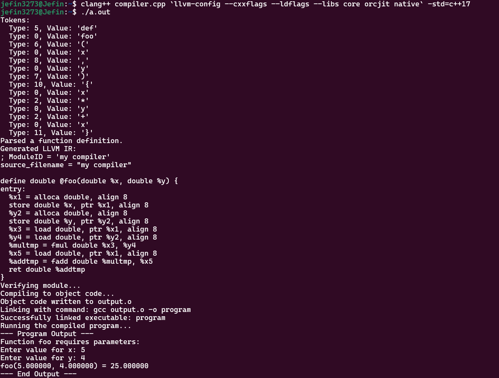
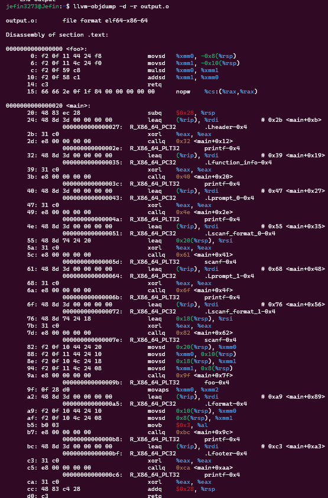

# Mini Compiler using LLVM
## Description
This project is a simple compiler that performs floating-point arithmetic operations on only two operands (`x` and `y`) using any operators. It also handles syntax errors and reports them accordingly.

## Features
- Works with any number of operators 
- Full AST generated and reports syntax errors
- Compiles to target assembly code

## Limitations
- Only works with **2** Operators - x & y
- No compile time assignment of values for Operators

## Requirements
- **Clang Compiler**
- **LLVM Toolchain**

## Compilation Instructions
To compile the project, run:
```sh
clang++ compiler.cpp `llvm-config --cxxflags --ldflags --libs core orcjit native` -std=c++17
```



```sh
./a.out // or ./a.exe for windows
```

## To get underlying assembly generated by LLVM
```sh
llvm-objdump -d -r output.o
```



## Team Members
1. Jefin John - 9904
2. Zane Fernandes - 9894
3. Preetham Fernandes - 9892
4. Andronicus Lall - 9911
5. Hardik Murudi - 9921
